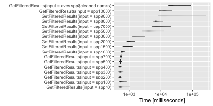
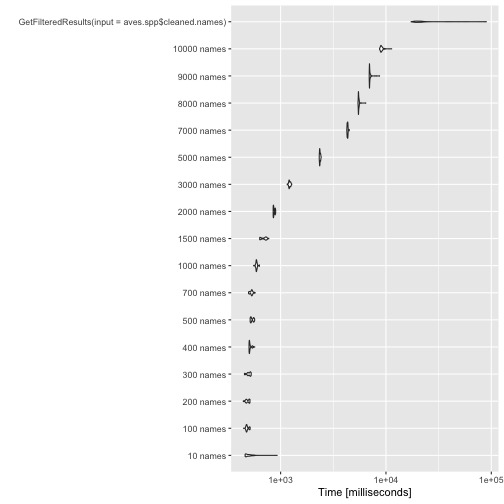
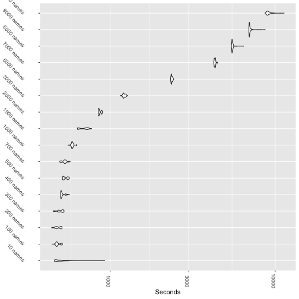
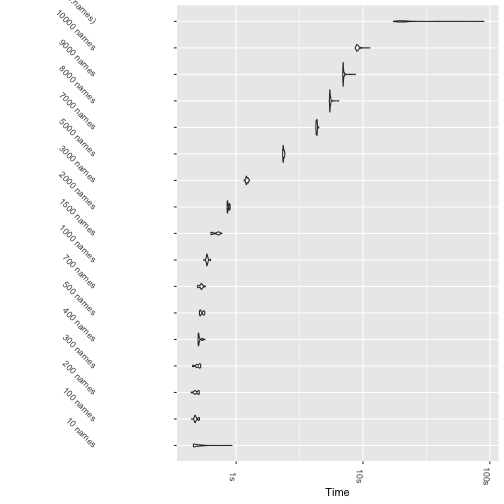
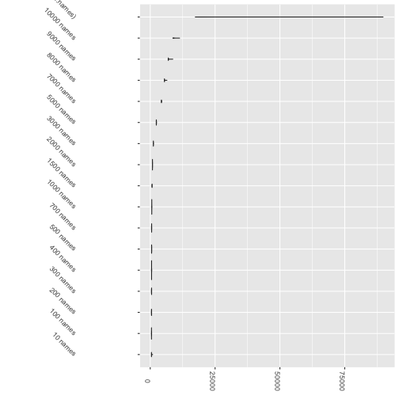
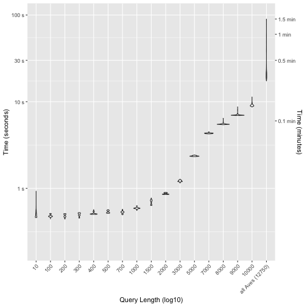
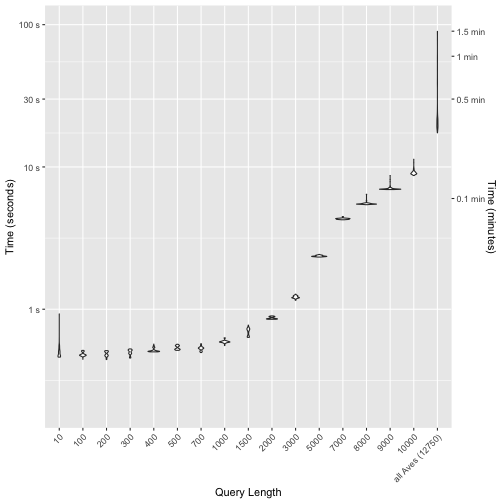

# Benchmarking Functions to Get Source Data

You'll need `datelife` and `microbenchmark` packages.

```r
install.packages("microbenchmark")
install.packages("datelife")
library(microbenchmark)
library(datelife)
```
Then, we generate a vector of seeds to use befire each test to be able to reproduce the results afterwards:


```r
set.seed(10)
seeds <- runif(100, 1, 1e9) 
# set.seed only accepts numbers up to 9 integers-ish:
# set.seed(2140000000)
# works with numbers <=2.14e+09
save(seeds, file="data/1_datasource/1_name_samples/seeds.RData")
```

## I. Function to search input taxa across a chronogram database

The `datelife` function that performs the chronogram searches is called `datelife_search` (previously called `get_filtered_results`)
To benchmark this function, we used species names of birds (any species within the Aves class) as input. Running time of the function was tested with a different number of input taxa: 10, 100, 200, 300, 400, 500, 700, 1000, 1500, 2000, 3000, 5000, 7000, 8000, 9000, 10000
and up to all named bird species in Open Tree Taxonomy (OTT).
To do this, first we obtained all named bird species from OTT with the `make_datelife_query` function:


```r
install.packages("datelife")
library(datelife)
aves.spp <- make_datelife_query(input="Aves", sppfromtaxon=TRUE) # 12750 spp names
save("aves.spp", file="data/1_datasource/1_name_samples/aves.spp.RData")
```


```r
names(aves.spp)
```

```
## [1] "phy"           "cleaned.names"
```

```r
length(aves.spp$cleaned.names)
```

```
## [1] 12750
```
So, there are 12750 named bird species in the OTT. Then, we generated a character vector of randomly sampled bird names for each input size. We saved these independently to ensure reproducibility:

```r
ninput <- c(10, 100, 200, 300, 400, 500, 700, 1000, 1500, 2000, 3000, 5000, 7000, 
            8000, 9000, 10000)
for (i in ninput){
	set.seed(seeds[1])
	x <- sample(aves.spp$cleaned.names, i)
	xname <- paste0("spp",i)
	assign(xname, x)
	save(list=xname, file=paste0(xname,".RData"))
}
```

This was my first time using `microbenchmark` to profile running time of functions, so I did a little test first, using 400 bird names drawn at random from `aves.spp$cleaned.names` vector, just to look at the structure of the output and all:

```r
set.seed(seeds[1])
spp400.1 <- sample(aves.spp$cleaned.names, 400)
aves400.1.gfr.runtime_2017.12.28 <- microbenchmark(get_datelife_result(input=spp400.1),
                                                   times=100L)
save(aves400.1.gfr.runtime_2017.12.28, file =
       "data/1_datasource/2_tests/1_same_spp_names/aves400.1.gfr.runtime_2017.12.28.RData")
```


```r
aves400.1.gfr.runtime_2017.12.28
```

```
## Unit: milliseconds
##                                expr     min       lq     mean   median
##  GetFilteredResults(input = spp400) 477.973 488.9229 513.7463 516.8565
##        uq      max neval
##  524.9569 568.6478   100
```

```r
names(aves400.1.gfr.runtime_2017.12.28)
```

```
## [1] "expr" "time"
```

```r
class(aves400.1.gfr.runtime_2017.12.28)
```

```
## [1] "microbenchmark" "data.frame"
```

```r
length(aves400.1.gfr.runtime_2017.12.28)
```

```
## [1] 2
```

```r
binded <- rbind(aves400.1.gfr.runtime_2017.12.28, aves400.1.gfr.runtime_2017.12.28)
# res <- rbind(thraupidae.ed.runtime_2017.12.28, thraupidae.ed.runtime_2017.12.28)
binded
```

```
## Unit: milliseconds
##                                expr     min       lq     mean   median
##  GetFilteredResults(input = spp400) 477.973 488.9229 513.7463 516.8565
##        uq      max neval
##  524.9569 568.6478   200
```

```r
class(binded)
```

```
## [1] "microbenchmark" "data.frame"
```

```r
length(binded)
```

```
## [1] 2
```

```r
microbenchmark:::autoplot.microbenchmark(binded)
```


Confident of understanding the structure of a microbenchmark output, we continued to start with the formal benchmarking tests.

Up to 1k names, we ran `microbenchmark` on the same R console and saved everything at the end with a loop:

```r
aves10.1.gfr.runtime_2017.12.28 <- microbenchmark(get_datelife_result(input=spp10),
                                                  times=100L)
aves100.1.gfr.runtime_2017.12.28 <- microbenchmark(get_datelife_result(input=spp100),
                                                   times=100L)
aves200.1.gfr.runtime_2017.12.28 <- microbenchmark(get_datelife_result(input=spp200),
                                                   times=100L)
aves300.1.gfr.runtime_2017.12.28 <- microbenchmark(get_datelife_result(input=spp300),
                                                   times=100L)
aves400.1.gfr.runtime_2017.12.28 <- microbenchmark(get_datelife_result(input=spp400),
                                                   times=100L)
aves500.1.gfr.runtime_2017.12.28 <- microbenchmark(get_datelife_result(input=spp500),
                                                   times=100L)
aves700.1.gfr.runtime_2017.12.28 <- microbenchmark(get_datelife_result(input=spp700),
                                                   times=100L)
aves1000.1.gfr.runtime_2017.12.28 <- microbenchmark(get_datelife_result(input=spp1000),
                                                    times=100L)
for(i in c(10,100,200,300,400,500,700,1000)){
	xname <- paste0("data/1_datasource/2_tests/1_same_spp_names/aves", i,
	                ".1.gfr.runtime_2017.12.28")
	save(list=xname, file=paste0(xname, ".RData"))
}
```
We ran each of the following in a different R console process and saved the results independently at the end of each run:

```r
aves1500.1.gfr.runtime_2017.12.28 <- microbenchmark(get_datelife_result(input=spp1500),
                                                    times=100L)
save(aves1500.1.gfr.runtime_2017.12.28, file =
    "data/1_datasource/2_tests/1_same_spp_names/aves1500.1.gfr.runtime_2017.12.28.RData")
aves2000.1.gfr.runtime_2017.12.28 <- microbenchmark(get_datelife_result(input=spp2000),
                                                    times=100L)
save(aves2000.1.gfr.runtime_2017.12.28, file =
    "data/1_datasource/2_tests/1_same_spp_names/aves2000.1.gfr.runtime_2017.12.28.RData")
aves3000.1.gfr.runtime_2017.12.28 <- microbenchmark(get_datelife_result(input=spp3000),
                                                    times=100L)
save(aves3000.1.gfr.runtime_2017.12.28, file =
    "data/1_datasource/2_tests/1_same_spp_names/aves3000.1.gfr.runtime_2017.12.28.RData")
aves5000.1.gfr.runtime_2017.12.28 <- microbenchmark(get_datelife_result(input=spp5000),
                                                    times=100L)
save(aves5000.1.gfr.runtime_2017.12.28, file =
    "data/1_datasource/2_tests/1_same_spp_names/aves5000.1.gfr.runtime_2017.12.28.RData")
aves7000.1.gfr.runtime_2017.12.28 <- microbenchmark(get_datelife_result(input=spp7000),
                                                    times=100L)
save(aves7000.1.gfr.runtime_2017.12.28, file =
    "data/1_datasource/2_tests/1_same_spp_names/aves7000.1.gfr.runtime_2017.12.28.RData")
aves8000.1.gfr.runtime_2017.12.28 <- microbenchmark(get_datelife_result(input=spp8000),
                                                    times=100L)
save(aves8000.1.gfr.runtime_2017.12.28, file =
    "data/1_datasource/2_tests/1_same_spp_names/aves8000.1.gfr.runtime_2017.12.28.RData")
aves9000.1.gfr.runtime_2017.12.28 <- microbenchmark(get_datelife_result(input=spp9000),
                                                    times=100L)
save(aves9000.1.gfr.runtime_2017.12.28, file =
    "data/1_datasource/2_tests/1_same_spp_names/aves9000.1.gfr.runtime_2017.12.28.RData")
aves10000.1.gfr.runtime_2017.12.28 <- microbenchmark(get_datelife_result(input=spp10000),
                                                     times=100L)
save(aves10000.1.gfr.runtime_2017.12.28, file =
    "data/1_datasource/2_tests/1_same_spp_names/aves10000.1.gfr.runtime_2017.12.28.RData")
aves.all.gfr.runtime_2017.12.29 <- microbenchmark(get_datelife_result(
  input=aves.spp$cleaned.names), times=100L)
save(aves.all.gfr.runtime_2017.12.29, file = 
       "data/1_datasource/2_tests/0_all_names/aves.all.gfr.runtime_2017.12.29.RData")
```

To plot the results, we loaded each data set into the same R console, `rbind`ed them and `autoplot` them:

```r
for(i in ninput){
	xname <- paste0("aves",i,".1.gfr.runtime_2017.12.28")
	x <- paste0(xname, ".RData")
	load(x)
	res <- rbind(res, get(xname))
}
res <- rbind(res, aves.all.gfr.runtime_2017.12.29)
microbenchmark:::autoplot.microbenchmark(res)
```



Results look weirdly flat. This might be because we ran some of the tests simultaneously on the same computer. So we ran the whole thing again, one test after another (not running tests at the same time in the computer):

```r
ninput <- c(10, 100, 200, 300, 400, 500, 700, 1000, 1500, 2000, 3000, 5000, 7000, 
            8000, 9000, 10000)
for(i in ninput){
	xname <- paste0("spp",i)
	load(paste0(xname,".RData"))
	x <- microbenchmark(get_datelife_result(input=get(xname), process_input=TRUE), 
	                    times=100L) # input must be processed :)
	# y <- levels(x$expr)
	# levels(x$expr)[levels(x$expr==y)] <- paste0(i, " names")
	levels(x$expr)[1] <- paste0(i, " names")
	xnameobj <- paste0("aves",i,".1.gfr.runtime_2017.12.29")
	assign(xnameobj, x)
	save(list=xnameobj, file=paste0("data/1_datasource/2_tests/1_same_spp_names/",
	                                xnameobj,".RData"))
	rm(list=xnameobj)
}
```
And we `rbind`ed the outputs again in a new console and used `autoplot` to visualize results:

```r
res <- c()
for(i in ninput){
	xname <- paste0("aves",i,".1.gfr.runtime_2017.12.29")
	res <- rbind(res, get(xname))
}
res <- rbind(res, aves.all.gfr.runtime_2017.12.29)
microbenchmark:::autoplot.microbenchmark(res)
```


This is good, but we want a prettier plot:

```r
autoplot.gfr <- function (object, ..., log = TRUE, y_max = 1.05 * max(object$time)) {
    y_min <- 0
    object$Time <- microbenchmark:::convert_to_unit(object$time, "t") 
    #changing the name of the element itself is the easiest way to make it appear as axis label
    # object$'Query Length' <- object$expr #changing for a name with spaces won't work...
    plt <- ggplot2::ggplot(object, ggplot2::aes_string(x = "expr", y = "Time"))
    plt <- plt + coord_cartesian(ylim = c(y_min, y_max))
    plt <- plt + stat_ydensity()
    # plt <- plt + xlim(levels(object$expr)[length(levels(object$expr)):1])
    plt <- plt + scale_x_discrete(name = "")
    plt <- plt + theme(axis.text.x = element_text(angle=270))
    plt <- plt + theme(axis.text.y = element_text(angle=315))
    plt <- if (log) {
        # plt + scale_y_log10(name = sprintf("", attr(object$ntime, "unit"))) 
          # this does not work...
        # plt + scale_y_log10(name = sprintf("Time", attr(object$ntime, "unit"))) 
          # this does not work...
        # plt + scale_y_log10(name = "Seconds") # this does not work either...
		plt + scale_y_log10(breaks=c(1e+03, 1e+035, 1e+04, 1e+045, 1e+05),
		                    labels=c("1e+03"="1s", "1e+035"="", "1e+04"="10s", 
		                             "1e+045"="", "1e+05"="100s"), position="top")
    }
    else {
        plt + scale_y_continuous(name = sprintf("Time [%s]", attr(object$ntime, "unit")))
    }
    plt <- plt + ggplot2::coord_flip() # these exchanges the axis
    # if I inactivate this, I get the following Warning message:
# Transformation introduced infinite values in continuous y-axis 
# Need to figure out how to transform time so I won't get this warning
    plt
}
```


```r
res
```

```
## Unit: milliseconds
##                                                expr        min         lq
##                                            10 names   460.6491   468.3091
##                                           100 names   444.3002   473.8266
##                                           200 names   442.6560   470.6063
##                                           300 names   453.9129   488.2513
##                                           400 names   501.5401   504.1451
##                                           500 names   514.1320   520.5501
##                                           700 names   495.9390   510.1794
##                                          1000 names   555.0866   585.2433
##                                          1500 names   634.0010   640.6306
##                                          2000 names   849.5531   853.3207
##                                          3000 names  1155.5370  1202.8818
##                                          5000 names  2326.2814  2346.8788
##                                          7000 names  4253.4614  4288.5441
##                                          8000 names  5428.8731  5475.4255
##                                          9000 names  6935.3147  6970.6808
##                                         10000 names  8704.5354  8924.5382
##  GetFilteredResults(input = aves.spp$cleaned.names) 17371.2235 19432.1327
##        mean     median         uq        max neval
##    499.4045   493.5562   512.0587   927.4246   100
##    483.6095   476.8866   501.9377   513.5377   100
##    485.7266   479.7484   505.2880   511.4978   100
##    498.0488   494.6400   516.3666   525.7149   100
##    514.5361   506.8924   515.8426   568.4390   100
##    536.5125   525.8690   554.6478   567.0744   100
##    529.1623   531.0563   537.6173   572.9678   100
##    590.3382   589.5628   594.2855   629.2195   100
##    691.2362   713.9762   727.1488   773.2362   100
##    866.4438   856.8874   886.5621   897.2533   100
##   1217.0782  1209.3488  1236.2134  1275.0065   100
##   2363.9692  2357.6281  2384.4152  2428.0448   100
##   4321.4643  4322.6020  4343.4763  4480.6982   100
##   5519.1140  5495.6470  5535.8770  6425.9949   100
##   7056.4538  6993.4646  7050.0582  8691.5719   100
##   9130.0255  9027.5328  9219.0096 11332.1156   100
##  25979.6494 20984.4261 22667.8657 89776.8991   100
```

```r
autoplot.gfr(res)
```



```r
autoplot.gfr(res, log=FALSE)
```


Results look good at this point. But we wanna have the time on the x axis.

```r
res.plt <- autoplot.gfr(res)
res.plt + scale_y_log10(name = "Seconds") # this does not work
```



```r
res.plt + scale_y_log10(labels =c("1e+03"="1s", "1e+035"="", "1e+04"="10s", 
                                  "1e+045"="", "1e+05"="100s")) 
```



```r
# this works to change the labels, but I need to specify breaks to be sure it works appropriately
labels(res.plt)
```

```
## [1] "data"        "layers"      "scales"      "mapping"     "theme"      
## [6] "coordinates" "facet"       "plot_env"    "labels"
```

```r
res.plt$labels
```

```
## $x
## [1] "expr"
## 
## $y
## [1] "Time"
```

```r
str(res.plt)
```

```
## List of 9
##  $ data       :Classes 'microbenchmark' and 'data.frame':	1700 obs. of  3 variables:
##   ..$ expr: Factor w/ 17 levels "10 names","100 names",..: 1 1 1 1 1 1 1 1 1 1 ...
##   ..$ time: num [1:1700] 9.27e+08 5.58e+08 5.56e+08 5.53e+08 5.18e+08 ...
##   ..$ Time: num [1:1700] 927 558 556 553 518 ...
##   .. ..- attr(*, "unit")= chr "milliseconds"
##  $ layers     :List of 1
##   ..$ :Classes 'LayerInstance', 'Layer', 'ggproto', 'gg' <ggproto object: Class LayerInstance, Layer, gg>
##     aes_params: list
##     compute_aesthetics: function
##     compute_geom_1: function
##     compute_geom_2: function
##     compute_position: function
##     compute_statistic: function
##     data: waiver
##     draw_geom: function
##     finish_statistics: function
##     geom: <ggproto object: Class GeomViolin, Geom, gg>
##         aesthetics: function
##         default_aes: uneval
##         draw_group: function
##         draw_key: function
##         draw_layer: function
##         draw_panel: function
##         extra_params: na.rm
##         handle_na: function
##         non_missing_aes: 
##         optional_aes: 
##         parameters: function
##         required_aes: x y
##         setup_data: function
##         use_defaults: function
##         super:  <ggproto object: Class Geom, gg>
##     geom_params: list
##     inherit.aes: TRUE
##     layer_data: function
##     map_statistic: function
##     mapping: NULL
##     position: <ggproto object: Class PositionDodge, Position, gg>
##         compute_layer: function
##         compute_panel: function
##         preserve: total
##         required_aes: 
##         setup_data: function
##         setup_params: function
##         width: NULL
##         super:  <ggproto object: Class Position, gg>
##     print: function
##     show.legend: NA
##     stat: <ggproto object: Class StatYdensity, Stat, gg>
##         aesthetics: function
##         compute_group: function
##         compute_layer: function
##         compute_panel: function
##         default_aes: uneval
##         extra_params: na.rm
##         finish_layer: function
##         non_missing_aes: weight
##         parameters: function
##         required_aes: x y
##         retransform: TRUE
##         setup_data: function
##         setup_params: function
##         super:  <ggproto object: Class Stat, gg>
##     stat_params: list
##     super:  <ggproto object: Class Layer, gg> 
##  $ scales     :Classes 'ScalesList', 'ggproto', 'gg' <ggproto object: Class ScalesList, gg>
##     add: function
##     clone: function
##     find: function
##     get_scales: function
##     has_scale: function
##     input: function
##     n: function
##     non_position_scales: function
##     scales: list
##     super:  <ggproto object: Class ScalesList, gg> 
##  $ mapping    :List of 2
##   ..$ x: language ~expr
##   .. ..- attr(*, ".Environment")=<environment: 0x1111f2728> 
##   ..$ y: language ~Time
##   .. ..- attr(*, ".Environment")=<environment: 0x1111f2728> 
##   ..- attr(*, "class")= chr "uneval"
##  $ theme      :List of 2
##   ..$ axis.text.x:List of 11
##   .. ..$ family       : NULL
##   .. ..$ face         : NULL
##   .. ..$ colour       : NULL
##   .. ..$ size         : NULL
##   .. ..$ hjust        : NULL
##   .. ..$ vjust        : num 1
##   .. ..$ angle        : num 270
##   .. ..$ lineheight   : NULL
##   .. ..$ margin       : 'margin' num [1:4] 2.2pt 0pt 0pt 0pt
##   .. .. ..- attr(*, "valid.unit")= int 8
##   .. .. ..- attr(*, "unit")= chr "pt"
##   .. ..$ debug        : NULL
##   .. ..$ inherit.blank: logi FALSE
##   .. ..- attr(*, "class")= chr [1:2] "element_text" "element"
##   ..$ axis.text.y:List of 11
##   .. ..$ family       : NULL
##   .. ..$ face         : NULL
##   .. ..$ colour       : NULL
##   .. ..$ size         : NULL
##   .. ..$ hjust        : num 1
##   .. ..$ vjust        : NULL
##   .. ..$ angle        : num 315
##   .. ..$ lineheight   : NULL
##   .. ..$ margin       : 'margin' num [1:4] 0pt 2.2pt 0pt 0pt
##   .. .. ..- attr(*, "valid.unit")= int 8
##   .. .. ..- attr(*, "unit")= chr "pt"
##   .. ..$ debug        : NULL
##   .. ..$ inherit.blank: logi FALSE
##   .. ..- attr(*, "class")= chr [1:2] "element_text" "element"
##   ..- attr(*, "class")= chr [1:2] "theme" "gg"
##   ..- attr(*, "complete")= logi FALSE
##   ..- attr(*, "validate")= logi FALSE
##  $ coordinates:Classes 'CoordFlip', 'CoordCartesian', 'Coord', 'ggproto', 'gg' <ggproto object: Class CoordFlip, CoordCartesian, Coord, gg>
##     aspect: function
##     backtransform_range: function
##     clip: on
##     default: FALSE
##     distance: function
##     expand: TRUE
##     is_free: function
##     is_linear: function
##     labels: function
##     limits: list
##     modify_scales: function
##     range: function
##     render_axis_h: function
##     render_axis_v: function
##     render_bg: function
##     render_fg: function
##     setup_data: function
##     setup_layout: function
##     setup_panel_params: function
##     setup_params: function
##     transform: function
##     super:  <ggproto object: Class CoordFlip, CoordCartesian, Coord, gg> 
##  $ facet      :Classes 'FacetNull', 'Facet', 'ggproto', 'gg' <ggproto object: Class FacetNull, Facet, gg>
##     compute_layout: function
##     draw_back: function
##     draw_front: function
##     draw_labels: function
##     draw_panels: function
##     finish_data: function
##     init_scales: function
##     map_data: function
##     params: list
##     setup_data: function
##     setup_params: function
##     shrink: TRUE
##     train_scales: function
##     vars: function
##     super:  <ggproto object: Class FacetNull, Facet, gg> 
##  $ plot_env   :<environment: 0x1111f2728> 
##  $ labels     :List of 2
##   ..$ x: chr "expr"
##   ..$ y: chr "Time"
##  - attr(*, "class")= chr [1:2] "gg" "ggplot"
```


Now, for each size of input names, we sampled 100 different vector of names: 


```r
ninput <- c(10, 100, 200, 300, 400, 500, 600, 700, 800, 900, 1000, 1500, 2000, 3000,
            4000, 5000, 6000, 7000, 8000, 9000, 10000)

for(i in ninput){
	x <- vector(mode="list")
	for(j in 1:100){
		x <- c(x, list(sample(aves.spp$cleaned.names, i)))
	}
	xname <- paste0("random_sample_",i, "_aves_spp")
	assign(xname, x)
	save(list=xname, file=paste0("data/1_datasource/1_name_samples/", xname,".RData"))
}
```
Now we noticed a slowdown on the first run, probably because cache is loading for the very first time. So we launched a first run that wass not recorded, to make sure everything is loaded when we start the actual tests:

```r
asd <- "((Zea mays,Oryza sativa),((Arabidopsis thaliana,(Glycine max,Medicago sativa)),
        Solanum lycopersicum)Pentapetalae);"
get_datelife_result(input=asd, process_input=TRUE)
```
Now we can run the tests consecutively again:

```r
for(i in ninput){
	xname <- paste0("random_sample_",i, "_aves_spp")
	setwd("data/1_datasource/1_name_samples")
	load(file=paste0(xname,".RData"))
	y <- microbenchmark(get_datelife_result(input=get(xname)[[1]], 
	                                        process_input = TRUE),times=1L)  
	# input should be processed? we are then testing two functions in here...
	levels(y$expr)[1] <- paste0(i, " names")
	for(j in 2:100){
		yy <- microbenchmark(get_datelife_result(input=get(xname)[[j]], process_input=TRUE), 
		                     times=1L)
		levels(yy$expr)[1] <- paste0(i, " names")
		y <- rbind(y, yy)
	}	
	rm(list=xname)
	xnameobj <- paste0("gfr_runtime_2018.01.10_", i,"_aves_spp")
	assign(xnameobj, y)
	save(list=xnameobj, file=paste0("data/1_datasource/2_tests/2_random_spp_names/1_gfr", 
	                                xnameobj,".RData"))
	rm(list=xnameobj)
}
aves.all.gfr.runtime_2018.01.12 <- microbenchmark(get_datelife_result(input =
                                  aves.spp$cleaned.names), times=100L)
levels(aves.all.gfr.runtime_2018.01.12$expr)[1] <- "12750"
save(aves.all.gfr.runtime_2018.01.12,
     file="data/1_datasource/2_tests/0_all_names/aves.all.gfr.runtime_2018.01.12.RData")
```
Now, load and `rbind` the stuff if you opened a new session:

```r
res01 <- c()
for(i in ninput){
	xname <- paste0("gfr_runtime_2018.01.10_",i,"_aves_spp")
	x <- paste0("data/1_datasource/2_tests/2_random_spp_names/1_gfr", xname, ".RData")
	load(x)
	res01 <- rbind(res01, get(xname))
}
load(file="data/1_datasource/2_tests/0_all_names/aves.all.gfr.runtime_2018.01.12.RData")
```

```r
res01 <- rbind(res01, aves.all.gfr.runtime_2018.01.12)
```

And plot again

We need to change xlabels. One way to do this is to change the levels of the `expr` element:

```r
levels(res01$expr) <- as.character(c(ninput, "all Aves (12750)"))
```
Then set the time limits:

```r
y_min <- 200
y_max <- 1e+5
res01$Time <- microbenchmark:::convert_to_unit(res$time, "t") 
#changing the name of the element itself is the easiest way to make it appear as axis label
# object$'Query Length' <- object$expr 
# note that if you try to use spaces here it won't work...
plt <- ggplot2::ggplot(res01, ggplot2::aes_string(x = "expr", y = "Time"))
plt <- plt + ggplot2::coord_cartesian(ylim = c(y_min, y_max))
plt <- plt + ggplot2::stat_ydensity()
plt <- plt + ggplot2::scale_x_discrete(name = "Query Length (log10)",
       labels=c("10 names" = "1",
                "100 names" = expression(10^2),
                "200 names" = expression(2*"x"*10^2),
                "300 names" = expression(3*"x"*10^2),
                "400 names" = expression(4*"x"*10^2),
                "500 names" = expression(5*"x"*10^2),
                "700 names" = expression(7*"x"*10^2),
                "1000 names" = expression(10^3),
                "1500 names" = expression(1.5*"x"*10^3),
                "2000 names" = expression(2*"x"*10^3),
                "3000 names" = expression(3*"x"*10^3),
                "4000 names" = expression(4*"x"*10^3),
                "5000 names" = expression(5*"x"*10^3),
                "6000 names" = expression(6*"x"*10^3),
                "7000 names" = expression(7*"x"*10^3),
                "8000 names" = expression(8*"x"*10^3),
                "9000 names" = expression(9*"x"*10^3),
                "10000 names" = expression(10^4),
                "12750" = expression(1.275*"x"*10^4)
       ))
plt <- plt + ggplot2::theme(axis.text.x = ggplot2::element_text(angle=45, hjust=1))
plt <- plt + ggplot2::theme(axis.text.y = ggplot2::element_text(angle=0))
plt <- plt + ggplot2::scale_y_log10(name="Time (seconds)", breaks=c(1e+03, 1e+04, 3e+04, 1e+05), 
        labels=c("1e+03"="1 s", "1e+04"="10 s", "3e+04"="30 s", "1e+05"="100 s"), 
            position="left",
            sec.axis = ggplot2::sec_axis(~ . *1, name="Time (minutes)", 
            breaks=c(6e+03, 3e+04, 6e+04, 9e+04), 
            labels=c("6e+03"="0.1 min", "3e+04"="0.5 min", "6e+04"="1 min", "9e+04"="1.5 min")))
plt
```


I didn't like the labels, let's try these ones:

```r
plt <- plt + ggplot2::scale_x_discrete(name = "Query Length", 
       labels=c("10 names" = "10", 
                "100 names" = "100", 
                "200 names" = "200", 
                "300 names" = "300", 
                "400 names" = "400", 
                "500 names" = "500", 
                "700 names" = "700", 
                "1000 names" = expression(1~0*0*0),
                "1500 names" = expression(1~500), 
                "2000 names" = expression(2~0*0*0), 
                "3000 names" = expression(3~0*0*0), 
                "4000 names" = expression(4~0*0*0), 
                "5000 names" = expression(5~0*0*0), 
                "6000 names" = expression(6~0*0*0), 
                "7000 names" = expression(7~0*0*0), 
                "8000 names" = expression(8~0*0*0), 
                "9000 names" = expression(9~0*0*0), 
                "10000 names" = expression(10~0*0*0), 
                "12750" = expression(12~750)))
plt
```



